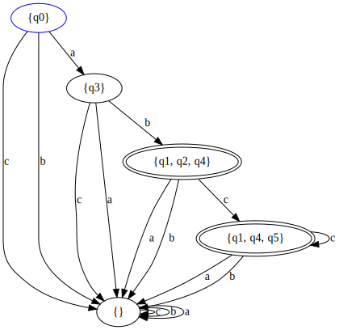
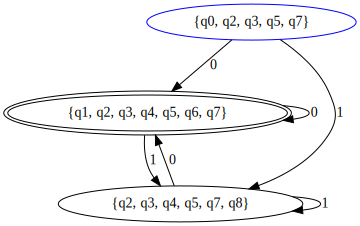
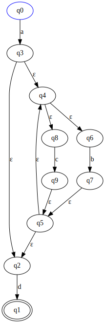
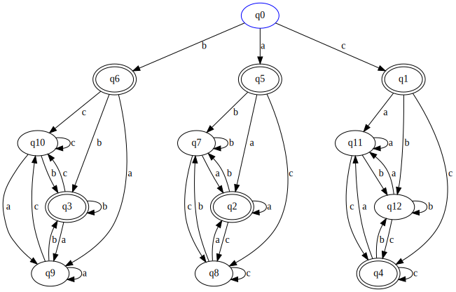

# automata

[](https://opensource.org/licenses/BSD-3-Clause)

This repository contains code that parses, emulates, does general conversions, and builds visualizations of finite automaton. Namely, it is able to parse a [Formal Language Theory](https://en.wikipedia.org/wiki/Formal_language) [Regular Expression](https://en.wikipedia.org/wiki/Regular_expression#Formal_language_theory) into machine-readable structures, convert them into [NFA-εs](https://en.wikipedia.org/wiki/Nondeterministic_finite_automaton#NFA_with_%CE%B5-moves) and [DFAs](https://en.wikipedia.org/wiki/Deterministic_finite_automaton), and finally generate [DOT language](https://graphviz.org/doc/info/lang.html) files out of those, for Graphviz visualization.

This software was created for educational purposes, and it follows closely the mathematical definitions one might see on an introductory computer theory class. It was not developed for practical use (i.e. as a general text processor) and does not follow the POSIX standard you're likely familiar with. It was built with performance in mind, but certainly not as a primary objective; there are multiple aspects that could be improved.

The project was written entirely in the Rust programming language, as its strong typing, performance and and memory safety features were deemed important. I do admit that I'm still a beginner with the language, therefore I'm sure there are issues and obvious mistakes in the code, so feel free to point them out and contribute. I will take a good look at any pull requests.

## Usage

Base command:

```
Parses Formal Regular Expressions and outputs graphs.

Usage: automata [OPTIONS] <EXPRESSION> [COMMAND]

Commands:
  dot    Export a DOT file for Graphviz
  svg    Export an SVG file (requires Graphviz)
  table  Export a transition table
  help   Print this message or the help of the given subcommand(s)

Arguments:
  <EXPRESSION>  Formal Regular Expression to be parsed

Options:
  -d, --dfa      Whether or not convert NFA-e to DFA
  -h, --help     Print help information
  -V, --version  Print version information
```

Exporting:

```
Usage: automata <EXPRESSION> <dot|svg|table> [OPTIONS] <OUTPUT>

Arguments:
  <OUTPUT>  Output path

Options:
  -n, --no-labels  No state labels (best with DFAs) (not available for table)
  -h, --help       Print help information
```

## Examples

A DFA that accepts strings in the format L = {ab, abc, abcc, abccc...}, Σ = {a,b,c} 

`automata 'abc*' -d svg example1.svg`



A DFA that accepts even numbers, Σ = {0,1} 

`automata '(0+1)*0' -d svg example2.svg`



A NFA-ε that accepts strings in the format L = {a, ab, ac, abb, abc, acb, abbb...}, Σ = {a,b,c} 

`automata 'a(b+c)*' svg example3.svg`



A DFA that accepts strings that begin and end with the same symbol, Σ = {a,b,c} 

`automata 'a+b+c+a(a+b+c)*a+b(a+b+c)*b+c(a+b+c)*c' -d svg -n example4.svg`



## Building

This project is to be built using cargo. Clone the project, run `cargo build` and you're good to go. For an optimized version, `cargo build --release` is available.

[You must have Rust installed.](https://www.rust-lang.org/tools/install)

## Reference

SILVA, M.V.G. Autômatos, Computabilidade e Complexidade Computacional, 2017.

HOPCROFT, J. E.; MOTWANI R.; ULLMAN, J. D. Introduction to Automata Theory, Languages, and Computation (2nd Edition), Addison Wesley, 2001.
